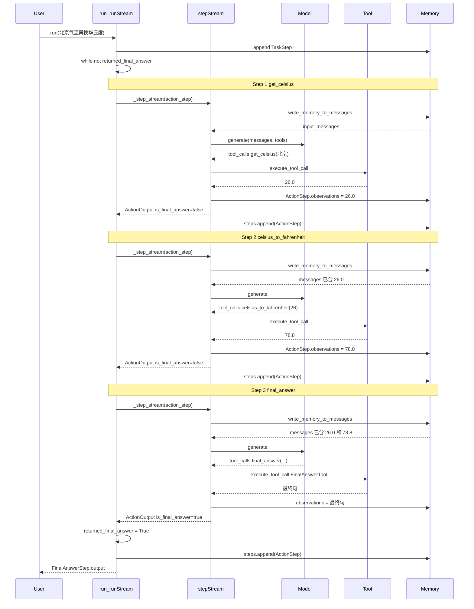

# Stage 1 第 4 课：FLOW

追踪这一条真实请求（第 3 课实验 1）：

```text
北京现在多少摄氏度？再把它换成华氏度。
```

入口：`run_demo.py` → `agent.run(...)`。`stream=False`，所以 `run` 会把 `_run_stream` 耗干再取最后一个 `FinalAnswerStep`。

## 时序图



## 真实调用链

主干每圈相同，只在 `execute_tool_call` 的工具名上分叉。

```text
run_demo.py
  agent.run(task)                                          agents.py:437
    MultiStepAgent.run
      memory.steps.append(TaskStep)                        agents.py:488
      list(_run_stream(...))                               agents.py:499 / 540
        while not returned_final_answer
             and step_number <= max_steps                  agents.py:545
          ToolCallingAgent._step_stream(action_step)       agents.py:578 / 1276
            write_memory_to_messages()                     agents.py:1284 / 758
              SystemPromptStep.to_messages
              + 每个 MemoryStep.to_messages
            Model.generate(input_messages, tools=...)      agents.py:1309
              OpenAIModel.generate                         models.py:1761
            process_tool_calls(chat_message, memory_step)  agents.py:1336 / 1361
              process_single_tool_call
                execute_tool_call(name, args)              agents.py:1390 / 1453
                  tool(...)                                agents.py:1486
                    Step1: get_celsius → 26.0
                    Step2: celsius_to_fahrenheit → 78.8
                    Step3: FinalAnswerTool.forward → 最终句
                           is_final_answer = (name == "final_answer")
                           agents.py:1406
                memory_step.observations += observation    agents.py:1436-1440
            yield ActionOutput(is_final_answer=...)        agents.py:1356-1358
          if ActionOutput.is_final_answer:                 agents.py:582
            returned_final_answer = True                   agents.py:591
          finally:
            memory.steps.append(action_step)               agents.py:602
            step_number += 1                               agents.py:604
        yield FinalAnswerStep(...)                         agents.py:609
      return steps[-1].output                              agents.py:502-503
```

基类 `MultiStepAgent._step_stream`（`agents.py:772`）是 `NotImplementedError`。真正干活的是子类 `ToolCallingAgent._step_stream`。

`model.generate` 的接口在 `Model.generate`（`models.py:553`）；这次 Demo 的实现是 `OpenAIModel.generate`（`models.py:1761`）。

## 观察回灌的三个函数

对应第 1 课的 `context.append(observation)`，以及第 3 课 Input tokens 1209 → 2504 → 3915：

1. `process_tool_calls` 把 observation 写进当前 `ActionStep`（`agents.py:1436-1440`）
2. `_run_stream` 的 `finally` 里 `self.memory.steps.append(action_step)`（`agents.py:602`）
3. 下一圈 `_step_stream` 开头 `write_memory_to_messages()`（`agents.py:758、1284`）把 Memory 编成 `input_messages`

所以第 2 圈 `generate` 时，messages 里已经有 `26.0`，模型才会传 `c=26`。

## 成功停止的两层

| 层 | 位置 | 做什么 |
|---|---|---|
| Step 内 | `tool_name == "final_answer"` → `ToolOutput.is_final_answer`（1406）→ `ActionOutput.is_final_answer`（1356） | 产生「结束」信号 |
| Loop 外 | `_run_stream` 看到 `ActionOutput.is_final_answer`（582）→ `returned_final_answer = True`（591） | `while` 条件失败，循环停 |

强制停止仍是 `step_number <= max_steps`（545）。这次 3 步结束，没走到 `_handle_max_steps_reached`（606）。

## 和第 3 课日志对齐

| 日志 | 链上哪一段 |
|---|---|
| `New run` / 任务标题 | `run` 里 `log_task` + `TaskStep` |
| `Step 1` / `Calling tool: get_celsius` | `_run_stream` 打 Step 号；`process_single_tool_call` 打 Calling tool |
| `Observations: 26.0` | `process_single_tool_call` 把 `tool_call_result` 变成字符串 |
| `Step 2` 参数 `c=26` | 上一圈 26.0 已经过「回灌三函数」 |
| `Calling tool: final_answer` | 仍是一次 `execute_tool_call` |
| `Final answer: ...` | `_run_stream` 582 行看到 `is_final_answer` |
| `RESULT: ...` | `run` 返回 `FinalAnswerStep.output` |
