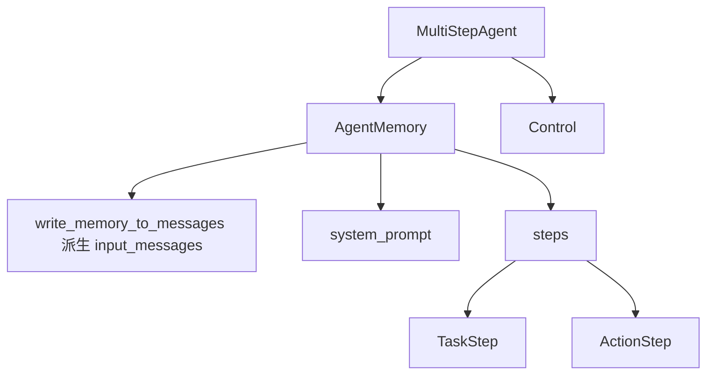

# Stage 1 第 5 课：STATE / CONTROL

FLOW 回答请求怎么走。这课分清三样东西：

```text
Memory  = 仓库（steps）
Context = 这一次塞给模型的输入（从 Memory 派生）
Control = 谁有权决定下一步（再 step 还是停）
```

对照温度任务：`北京现在多少摄氏度？再把它换成华氏度。`

## 状态结构



一次温度 `run` 里，`memory.steps` 通常是：

```text
TaskStep
ActionStep  Step1 get_celsius → observations=26.0
ActionStep  Step2 celsius_to_fahrenheit → observations=78.8
ActionStep  Step3 final_answer → is_final_answer=True
```

系统提示在 `memory.system_prompt`，不在 `steps` 里。`PlanningStep` 这课不深入。

`ActionStep` 里不要认错字段：

| 字段 | 是什么 |
|---|---|
| `model_input_messages` | 这一圈喂给模型的 Context 拷贝，不是模型说的话 |
| `model_output` / `model_output_message` / `tool_calls` | 模型刚说的 |
| `observations` / `action_output` | 工具刚干的 |
| `is_final_answer` | 这一圈是否发出了成功停止信号 |

## Memory / Context / Control

| | 是什么 | 谁改 | 这次 run 内何时写入 |
|---|---|---|---|
| Memory | `AgentMemory`：`system_prompt` + `steps` | `run` 写入 `TaskStep`；每圈 `finally` append `ActionStep`；`process_tool_calls` 改当前 step 的 `observations` | 存在这次进程里的 `self.memory`。`reset=True` 时 `memory.reset()` 清空 `steps`。不是磁盘上的长期记忆 |
| Context | `write_memory_to_messages()` 现算出来的 `input_messages` | 不单独存一份「权威 Context」。每圈开头从 `steps` 派生，再 copy 到当前 `ActionStep.model_input_messages` | 每圈 `_step_stream` 开始时生成；下一圈会重新生成，因此能看见上一圈的 `26.0` |
| Control | `step_number`、`returned_final_answer`、`max_steps`、`interrupt_switch` | `_run_stream` 的 `while` 读写这些字段 | 循环入口判断；`final_answer` 后把 `returned_final_answer=True`；每圈结束 `step_number += 1` |

`self.tools` 是 Agent **配置**，不是这次对话状态。`reset=True` 清 Memory，不清工具表。

`self.state` 是运行时字典（给工具参数替换等用），Stage 1 标「暂不深入」，不要和 `AgentMemory` 混成一个仓库。

## 谁决定下一步

两层，不要合成一句「模型在控制循环」。

| 问题 | 谁决定 | 温度任务 |
|---|---|---|
| 下一步调哪个工具 | **模型**（`generate` 产出 `tool_calls`） | Step1 选 `get_celsius`，Step2 选 `celsius_to_fahrenheit` |
| 还要不要再转一圈 | **循环**（`while not returned_final_answer and step_number <= max_steps`） | Step3 模型选出 `final_answer` → `is_final_answer` → `returned_final_answer=True` → `while` 不再进入 Step4 |

`final_answer` 和 `max_steps` 都是信号，不是 `while` 本身：

```text
成功停：模型调用 final_answer
        → ActionOutput.is_final_answer
        → returned_final_answer = True
        → while 结束

强制停：step_number 超过 max_steps
        → while 结束（任务未必成功）
```

一句话：

```text
模型选 Act。
while 选是否再 step。
```

## 和第 1、4 课的衔接

第 1 课的 `context.append(observation)` 在这里拆开：观察写入 `ActionStep`，append 进 `memory.steps`，下一圈再派生 Context。

第 4 课的调用链里，545 / 591 / 602 / 758 / 1284 行就是 Control 和 Memory 的交界，不再重复画 FLOW。
