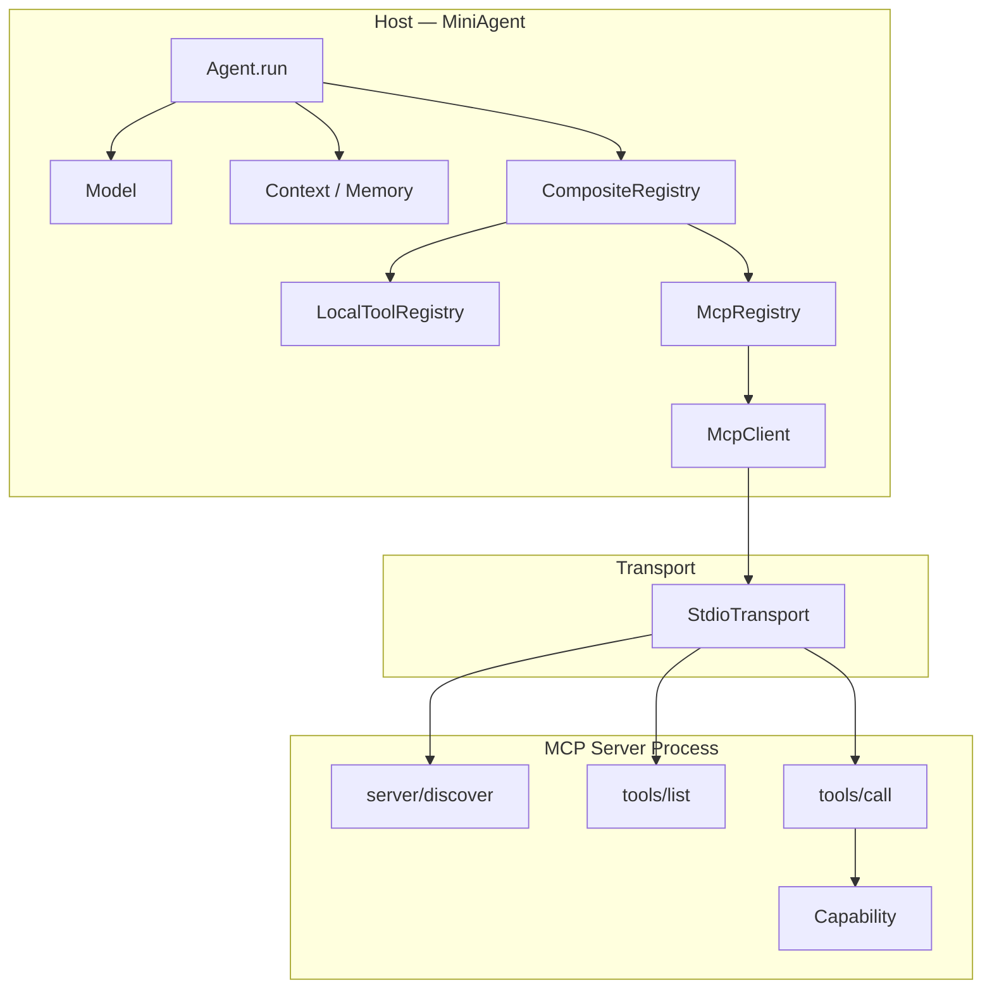
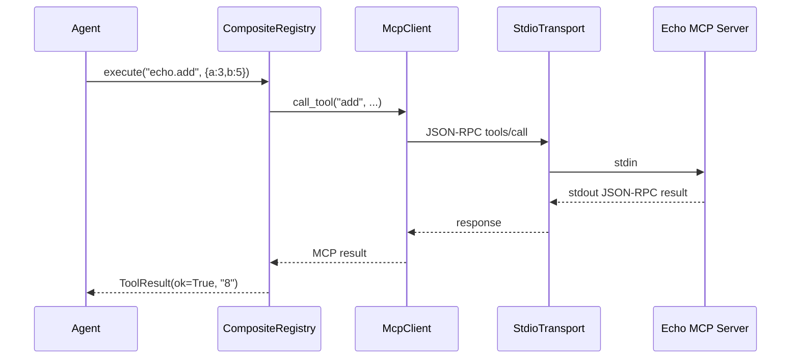
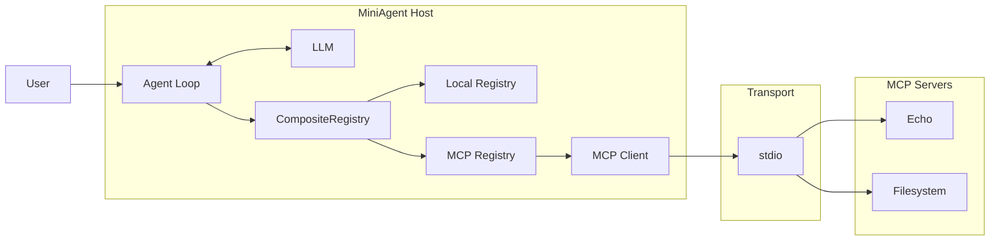

# MiniAgent Stage 3：MCP — Coding First / Pair Programming Edition

## 0. 本阶段定位

仓库：

```text
FluxForgeLab/MiniAgent
```

当前已有：

```text
01-mini-agent/
```

本阶段新增：

```text
02-mcp/
```

但不重写 `01-mini-agent` 的 Agent Loop。

本阶段只解决一个问题：

> MiniAgent 如何在不知道 Tool 实现细节的情况下，通过标准协议发现并调用进程外能力？

第一性原理：

```text
Agent 不应该依赖 Tool 实现。

Agent 只应该知道：

Capability
Schema
Invocation
Result
Error
```

最终结构：

```text
Agent
  ↓
ToolProvider
  ↓
CompositeRegistry
  ├── Local ToolRegistry
  │
  └── MCP Registry
        ↓
      MCP Client
        ↓
      Transport
        ↓
      MCP Server
        ↓
   Real Capability
```

本阶段的目标不是：

> 把 MCP Specification 全读懂。

而是：

> 在 MiniAgent 中亲手建立一次完整的 MCP 调用链，然后通过失败实验理解为什么协议需要这些设计。

学习模式统一改为：

```text
TRACE
  ↓
CHANGE
  ↓
TEST
  ↓
BREAK
  ↓
FIX
  ↓
EXPLAIN
```

不再执行：

```text
READ → 大量笔记 → 再开始 Coding
```

---

# 1. 先冻结 MiniAgent 已经正确的部分

当前 Agent Loop：

```text
model.generate(...)
      ↓
tool call
      ↓
registry.execute(...)
      ↓
ToolResult
      ↓
memory
      ↓
context
      ↓
下一轮模型调用
```

这一部分本阶段原则上不改。

当前真正的 MCP 接缝只有：

```python
registry.schema()
registry.execute(name, arguments)
```

因此理想结果是：

```text
Agent
 │
 │ schema / execute
 ▼
ToolProvider
 │
 ├──────── LocalRegistry
 │
 └──────── McpRegistry
```

Agent 根本不应该知道：

```text
JSON-RPC
stdio
server/discover
tools/list
tools/call
subprocess
protocolVersion
```

如果最后这些东西进入了 `agent.py`：

> 架构失败。

---

# 2. 第一处必须先修：统一 Tool Schema Contract

这是结合当前 MiniAgent 源码后新增的一步。

现在本地 Tool 的 schema 类似：

```python
{
    "city": {
        "type": "string",
        "description": "城市名称"
    }
}
```

然后 `model.py` 再包装成：

```json
{
  "type": "object",
  "properties": {...},
  "required": ["city"]
}
```

问题在于：

```text
MiniAgent input_schema
≠
完整 JSON Schema
```

它无法完整表达：

```text
optional field
nested object
array
enum
oneOf
default
additionalProperties
...
```

而 MCP `tools/list` 返回的 `inputSchema` 本身就是完整 JSON Schema。

所以在学习 MCP 之前先做一次极小重构。

## 新内部契约

统一：

```python
input_schema = {
    "type": "object",
    "properties": {
        "city": {
            "type": "string",
            "description": "城市名称"
        }
    },
    "required": ["city"]
}
```

以后：

```text
Local Tool
        ↓
   Tool Schema
        ↑
MCP Tool
```

使用同一种内部表达。

`to_openai_tools()` 不再猜：

```python
"required": list(properties.keys())
```

而是：

```python
"parameters": item["input_schema"]
```

## 验收测试

增加一个包含可选参数的 Tool：

```text
search(
    query: required string,
    limit: optional integer
)
```

确认：

```text
limit 没有进入 required
```

这一步非常小，但它会决定后面 MCP Adapter 是否干净。

---

# 3. 第二处调整：使用现代 MCP Core

本阶段协议版本冻结为：

```text
2026-07-28
```

当前 MCP 已进入 stateless core。

因此本阶段不再实现旧流程：

```text
initialize
   ↓
initialized
   ↓
session
   ↓
tools/list
```

改成：

```text
server/discover
      ↓
tools/list
      ↓
tools/call
```

`server/discover` 对现代 Server 是能力发现入口；现代协议不再依赖 `initialize/initialized` 和协议级 Session。

每个请求自行携带协议上下文，例如概念上：

```json
{
  "jsonrpc": "2.0",
  "id": 1,
  "method": "tools/list",
  "params": {
    "_meta": {
      "io.modelcontextprotocol/protocolVersion": "2026-07-28",
      "io.modelcontextprotocol/clientCapabilities": {},
      "io.modelcontextprotocol/clientInfo": {
        "name": "mini-agent",
        "version": "0.1"
      }
    }
  }
}
```

这里要真正理解的是：

```text
旧 MCP

connection
    ↓
initialize
    ↓
保存 session state
    ↓
后续请求依赖 session


现代 MCP

request
    ↓
request 自己描述必要上下文
    ↓
server 直接处理
```

不要为了学习现代 MCP 再专门实现一套旧 Session 生命周期。

旧协议只要求：

> 能看懂，不要求自己实现。

---

# 4. 本阶段只实现这个 MCP 子集

Core：

```text
JSON-RPC 2.0

server/discover
tools/list
tools/call
```

Transport：

```text
stdio
```

Tool Result：

```text
MCP result
     ↓
McpResultAdapter
     ↓
ToolResult(
    ok=...,
    observation="..."
)
```

暂不实现：

```text
Resources
Prompts

Streamable HTTP
OAuth

MRTR / Elicitation
Tasks

MCP Apps
Extension Framework

多并发请求
Tool catalog 热更新
复杂缓存
```

原因不是这些不重要。

而是当前学习目标只有：

> Tool 从进程内函数变成协议另一端的 Capability。

一次只证明一个抽象。

---

# 5. 最终目标架构



核心边界：

```text
Agent        → What should I do?

Registry     → Which capability owns this tool?

McpClient    → How do I speak MCP?

Transport    → How do bytes move?

MCP Server   → What capability do I provide?
```

---

# 6. 仓库建议结构

```text
02-mcp/
│
├── README.md
│
├── protocol.py
├── transport.py
├── client.py
├── registry.py
├── main.py
│
├── servers/
│   ├── echo.py
│   └── filesystem.py
│
├── sandbox/
│   └── README.md
│
└── tests/
    ├── test_protocol.py
    ├── test_transport.py
    ├── test_client.py
    ├── test_registry.py
    └── test_filesystem.py
```

其中：

```text
protocol.py
```

只负责：

```text
JSON-RPC message
request id
_meta envelope
response / error parsing
```

禁止：

```text
subprocess
Agent
ToolRegistry
```

---

```text
transport.py
```

只负责：

```text
启动 Server
stdin 写
stdout 读
stderr 日志
timeout
close
```

不知道：

```text
tools/list 是什么
```

---

```text
client.py
```

负责：

```text
discover()
list_tools()
call_tool()
```

不知道：

```text
Agent memory
OpenAI
CompositeRegistry
```

---

```text
registry.py
```

负责：

```text
MCP Tool → MiniAgent Tool Schema
tool prefix
local / remote routing
MCP Result → ToolResult
```

这是：

> MCP 世界与 MiniAgent 世界真正的 Adapter。

---

# 7. Coding Milestone 0：Tool Contract 对齐

## 目标

先把 MiniAgent 内部 Tool Schema 改成完整 JSON Schema。

涉及：

```text
01-mini-agent/tools.py
01-mini-agent/model.py
对应 test
```

Agent Loop 不动。

## 你负责理解

只回答：

```text
为什么 Tool Schema 不应该由 OpenAI Adapter 猜 required？
```

## Cursor Agent 负责

让 Agent：

```text
1. 找出 Tool schema 从定义到 OpenAI request 的完整数据流
2. 写失败测试
3. 改成完整 JSON Schema
4. 跑现有全部测试
```

## 完成条件

```text
现有测试全绿

+

optional argument test 全绿

+

Agent.run 无行为变化
```

Commit 建议：

```text
refactor(tool): normalize tool input schema to JSON Schema
```

---

# 8. Coding Milestone 1：亲手打通最小 MCP Server

这时才创建：

```text
02-mcp/
```

只实现：

```text
echo.add(a, b)
```

Server 支持：

```text
server/discover
tools/list
tools/call
```

暂时：

```text
没有 McpClient
没有 Agent
没有 Registry
```

直接：

```text
stdin
  ↓
echo.py
  ↓
stdout
```

手工输入 JSON。

例如：

```text
server/discover
```

再：

```text
tools/list
```

看到：

```text
add
```

再：

```text
tools/call
```

得到：

```text
8
```

## 本切片真正学习的东西

不是：

```text
MCP SDK 怎么用
```

而是：

```text
JSON-RPC request
        ↓
method dispatch
        ↓
Tool lookup
        ↓
execution
        ↓
JSON-RPC response
```

## 必须故意打坏一次

调用：

```text
tool = "does_not_exist"
```

观察：

```text
JSON-RPC error

或者

ToolResult isError
```

为什么错误必须通过协议返回，而不是：

```text
raise → Server 进程崩溃
```

---

# 9. Coding Milestone 2：实现 Transport + McpClient

这一步把：

```text
手工输入 JSON
```

替换为：

```text
McpClient
```

结构：

```text
McpClient
     │
     ▼
StdioTransport
     │
     ▼
echo.py
```

最小 API：

```python
client.discover()

client.list_tools()

client.call_tool(
    "add",
    {"a": 3, "b": 5}
)
```

---

## StdioTransport

负责：

```text
Popen
stdin
stdout
stderr
timeout
shutdown
```

Client 不允许到处：

```python
process.stdin.write(...)
```

必须全部收口在 Transport。

---

## 请求 ID

先做：

```text
single-flight
```

即同一 Client：

```text
一次只存在一个 outstanding request
```

现在不要做：

```text
async
并发 request map
background reader
```

否则你会从“学 MCP”变成“写 RPC Framework”。

---

## FAILURE 必做

至少：

```text
invalid JSON
unknown method
unknown tool
invalid arguments
timeout
server process exits
```

Timeout 必须变成：

```python
ToolResult(
    ok=False,
    observation="mcp timeout: ..."
)
```

而不是：

```text
整个 MiniAgent 卡死
```

---

# 10. Coding Milestone 3：第一次接入 MiniAgent

到这里才允许出现：

```text
Agent
```

实现：

```text
McpRegistry

CompositeRegistry
```

---

## McpRegistry

负责：

```text
client.list_tools()
       ↓
MCP Tool Schema
       ↓
MiniAgent Tool Schema
```

以及：

```text
MiniAgent execute
       ↓
client.call_tool
       ↓
MCP Result
       ↓
ToolResult
```

---

## CompositeRegistry

实现：

```python
schema()

execute(name, arguments)
```

内部：

```text
CompositeRegistry

├── LocalToolRegistry
│
└── McpRegistry
```

---

## 命名空间

保留原方案：

```text
本地：

get_celsius


MCP：

echo.add
fs.read_file
```

Host 层映射：

```text
echo.add
   ↓
Server = echo
Tool   = add
```

真正发给 MCP Server：

```json
{
  "name": "add"
}
```

Server 永远不知道：

```text
echo.add
```

这个 prefix 是 Host 的 routing concern。

---

# 11. 这一步必须先 FakeModel

脚本：

```text
FakeModel

第 1 轮：
    echo.add(
        a=3,
        b=5
    )

第 2 轮：
    final_answer("8")
```

验证：

```text
Agent
 ↓
CompositeRegistry
 ↓
McpRegistry
 ↓
McpClient
 ↓
stdio
 ↓
echo MCP Server
 ↓
8
 ↓
ToolResult
 ↓
Memory
 ↓
Context
 ↓
FakeModel
```

这才是整个阶段最关键的一条 FLOW。

需要画这一张 sequence diagram。

只画真实存在的组件：



---

# 12. 然后只跑一次真模型

FakeModel 全绿之后：

```text
MiniAgent + OpenAIModel + echo MCP
```

任务：

```text
计算 37 * 19，并告诉我结果。
```

增加：

```text
echo.multiply
```

或者继续 add。

真模型成功一次即可。

本阶段不需要反复烧 Token。

目的只是证明：

```text
LLM Tool Calling
        ↓
MiniAgent Tool abstraction
        ↓
MCP
```

可以完整连接。

---

# 13. Coding Milestone 4：Filesystem Server

这是本阶段最重要的 Capability Server。

因为它第一次引入：

```text
真正的安全边界。
```

只做：

```text
list_dir(path)

read_file(path)
```

不要做：

```text
write
delete
chmod
shell
exec
```

---

## Sandbox

固定：

```text
02-mcp/sandbox/
```

所有 path：

```text
user path
   ↓
resolve
   ↓
absolute path
   ↓
verify under root
```

例如：

```text
../../.ssh/id_rsa
```

必须失败。

这里学习的不是：

```text
Python pathlib
```

而是：

> Capability Provider 必须自己执行权限边界。

Host 可以做 allowlist。

但 Server 不能因为：

```text
“Host 应该已经检查过”
```

就信任输入。

---

## 必须破坏一次

先故意不加 sandbox check。

然后测试：

```text
../
```

证明可以逃逸。

随后修复。

这个 BREAK → FIX 比读十页 MCP 安全文档更有学习价值。

---

# 14. Coding Milestone 5：使用官方 SDK 做互操作验证

到这一步开始解除：

```text
“禁止使用 MCP SDK”
```

之前禁止，是为了避免：

```text
SDK 把协议细节全部藏掉。
```

现在核心流程已经亲手做过。

继续拒绝 SDK 已经没有学习价值。

下一步应该反过来：

> 用 SDK 验证自己的实现到底是不是 MCP，而不是“长得像 MCP”。

至少完成一个：

```text
我们的 Client
      ↓
官方 SDK Server
```

或者：

```text
官方 SDK Client
      ↓
我们的 Server
```

最好最终两个方向都跑通。

出现兼容性错误时：

```text
SDK behavior
      ↓
查对应 Specification
      ↓
修我们的实现
```

形成：

```text
Implementation
     ↕
Specification
     ↕
Reference SDK
```

这一步以后才真正算：

> “我实现的是 MCP”。

而不仅是：

> “我实现了一套 JSON-RPC”。

---

# 15. Git / Search Server 从必修改为挑战题

原方案还有：

```text
git.status
git.log

search.grep
```

新版不作为 Stage 3 验收条件。

原因：

MCP 核心知识在：

```text
echo
+
filesystem
```

已经出现过：

```text
Discovery
Schema
Invocation
Transport
Process Lifecycle
Error
Timeout
Routing
Permission
Sandbox
Agent integration
Interoperability
```

继续写 Git/Search 大量工作只是：

```text
重复写 Tool handler
```

而不是增加新的协议认知。

因此调整成：

## Challenge A

自己实现：

```text
git.status
```

不看本方案。

## Challenge B

自己实现：

```text
search.grep
```

并接入 CompositeRegistry。

如果能够独立做出来：

说明 MCP Tool Provider 的抽象已经真正掌握。

---

# 16. 本阶段只保留一个学习笔记

原方案每课一个：

```text
01-derive.md
02-why-what.md
03-run.md
04-flow.md
...
```

全部取消。

避免：

> 为了证明自己在学习而写文档。

只保留：

```text
00-reading-notes/stage3-mcp/README.md
```

内容只允许四部分：

```text
# 1. Architecture

一张架构图


# 2. Flow

一张 tools/call sequence diagram


# 3. Failure

我实际遇到过什么失败


# 4. Lessons

我现在如何理解：
Host / Client / Transport / Server
```

控制在真正有复用价值的内容。

---

# 17. Cursor 结对编程规则

Cursor Agent 不是：

```text
替你完成练习的人
```

而是：

```text
实现者 + Reviewer + Debugger
```

你负责：

```text
Boundary
Architecture
Acceptance
Failure reasoning
```

Agent 负责：

```text
Code
Tests
Refactor
Search
Mechanical work
```

---

## 每个 Milestone 使用同一个 Prompt 模板

```text
你现在是我的结对编程 Agent。

当前只做：

<MILESTONE>

学习目标：

<ONE CONCEPT>

约束：

1. 不修改当前 Milestone 以外的架构。
2. 不提前实现后续功能。
3. 优先写能证明行为的测试。
4. 不因为“更优雅”就引入框架。
5. 发现当前设计存在结构性问题时先指出，不要直接大改。
6. 修改完成后运行相关测试。
7. 最后只向我解释：
   - 改了什么
   - 为什么
   - 数据流是什么
   - 哪个测试证明它是对的

开始前先阅读相关源码，给我不超过 10 行的当前数据流说明，然后直接实施。
```

这里特别注意：

不要让 Cursor：

```text
“帮我实现完整 MCP”
```

而是：

```text
“当前只实现 server/discover”
```

或者：

```text
“当前只实现 StdioTransport timeout”
```

Agent Coding 最大的问题通常不是写不出来。

而是：

> 一次让它控制太大的设计空间。

---

# 18. 每次你真正需要 Review 的只有四件事

不需要逐行阅读 Agent 写的代码。

重点检查：

```text
① Boundary

代码是不是写到了正确层？


② Contract

输入输出是什么？


③ Failure

失败时会发生什么？


④ Test

哪个测试证明行为成立？
```

例如：

Agent 写完：

```text
McpClient.call_tool()
```

你不用立刻研究全部 Python 细节。

你首先问：

```text
它是否直接碰 Agent？

它是否直接操作 Popen？

它是否把 MCP error 转成 ToolResult？

timeout 谁负责？
```

这就是 Harness Engineer 更应该建立的阅读习惯。

---

# 19. BREAK 实验最终保留五个

完成 Stage 3 前故意制造：

```text
① MCP Server 找不到 Tool

② Tool arguments 不符合 Schema

③ Server sleep 导致 timeout

④ JSON-RPC response id 错误

⑤ filesystem ../ 越权
```

对每个问题只回答：

```text
谁应该发现？

谁应该处理？

最终 Agent 看到什么？
```

例如：

```text
filesystem ../
```

答案应该接近：

```text
Server
  ↓
拒绝访问
  ↓
MCP error/tool error
  ↓
Client
  ↓
ToolResult(ok=False)
  ↓
Memory
  ↓
LLM
```

而不是：

```text
Exception
  ↓
Agent crash
```

---

# 20. Stage 3 最终验收

最终不再按“完成 14 课”验收。

而按能力验收。

必须能自己解释：

```text
1. Host 和 MCP Client 为什么不是一个东西？

2. 为什么 Agent 不应该知道 stdio？

3. tools/list 和 MiniAgent registry.schema() 本质是什么关系？

4. tools/call 和 registry.execute() 本质是什么关系？

5. 为什么 MCP Tool Schema 必须保留完整 JSON Schema？

6. Transport 为什么不能和 Capability 混在一起？

7. MCP Server 为什么必须自己做权限检查？

8. MCP error 为什么应该进入 Agent observation/context？

9. 现代 MCP 为什么弱化 connection/session state？

10. Function Calling 和 MCP 各自在调用链的哪一段？
```

并且可以指到自己的代码：

```text
Tool abstraction     → xxx.py

JSON-RPC             → protocol.py

Process / bytes      → transport.py

MCP semantics        → client.py

Agent adapter        → registry.py

Security boundary    → filesystem.py
```

---

# 21. 最终必须跑通的场景

## 场景一：本地 Tool

```text
User
 ↓
Agent
 ↓
get_celsius
 ↓
ToolResult
 ↓
LLM
```

证明：

```text
原能力没有被 MCP 改坏。
```

---

## 场景二：MCP Echo

```text
User
 ↓
Agent
 ↓
echo.add
 ↓
MCP Client
 ↓
stdio
 ↓
Echo Server
 ↓
8
 ↓
LLM
```

证明：

```text
MCP Adapter 接入成功。
```

---

## 场景三：MCP Filesystem

```text
User

“读取 sandbox README”
 ↓
LLM
 ↓
fs.read_file
 ↓
MCP
 ↓
Filesystem Server
 ↓
Sandbox
 ↓
content
 ↓
LLM answer
```

证明：

```text
真实 Capability + Security Boundary
```

---

## 场景四：越权

```text
fs.read_file("../../xxx")
```

最终：

```text
Agent 不崩

Server 不越权

错误进入 Context
```

---

## 场景五：互操作

```text
我们的实现
    ↕
官方 SDK
```

至少一个方向跑通。

---

# 22. 完成后的架构应该保持这样



最重要的依赖方向：

```text
Agent

不知道

MCP
stdio
JSON-RPC
subprocess
```

这就是本阶段最大的验收标准。

---

# 23. 后续再学什么

完成本阶段以后，再按实际需求进入：

```text
MCP Resources
      ↓
MCP Prompts
      ↓
Streamable HTTP
      ↓
OAuth / Authorization
      ↓
MRTR / Elicitation
      ↓
Tasks
      ↓
Extensions
      ↓
Production MCP Gateway
```

不要现在一起塞进 Stage 3。

否则会失去当前实验真正要建立的抽象：

```text
Local Tool

        ↓

Protocol Boundary

        ↓

External Capability
```

---

# 24. 推荐实际执行顺序

不按 Day 划分，按 Coding Session：

```text
Session 0
Tool Schema Contract
        ↓

Session 1
JSON-RPC + Echo MCP Server
        ↓

Session 2
StdioTransport + McpClient
        ↓

Session 3
CompositeRegistry + FakeModel + Agent
        ↓

Session 4
Filesystem + Sandbox + BREAK
        ↓

Session 5
Official SDK Interoperability
        ↓

Challenge
Git / Search
```

如果某一步没理解：

```text
停在这一层继续 BREAK / FIX
```

而不是：

```text
继续读文档
```

---

# 25. Stage 3 的一句话目标

最终你应该能够从源码层面解释：

> MiniAgent 的 Agent Loop 并没有因为 MCP 发生变化；变化的只是 Tool Provider 从进程内 Python 函数变成了一个通过标准协议访问的外部 Capability Provider。

如果这一点建立起来：

```text
MCP
```

就不再是一套需要背的 API。

而是：

```text
Agent Harness 中的一条标准 Capability Boundary。
```