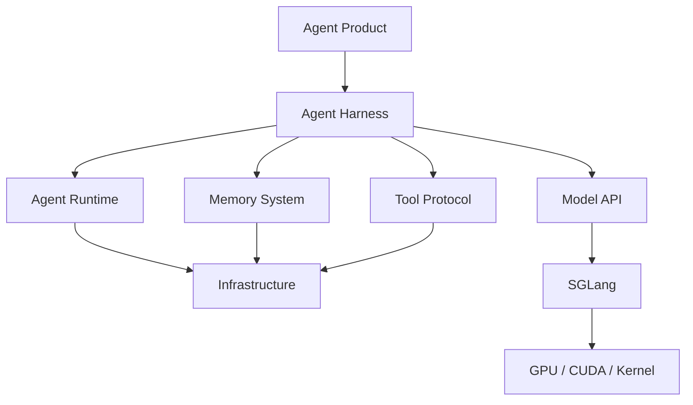
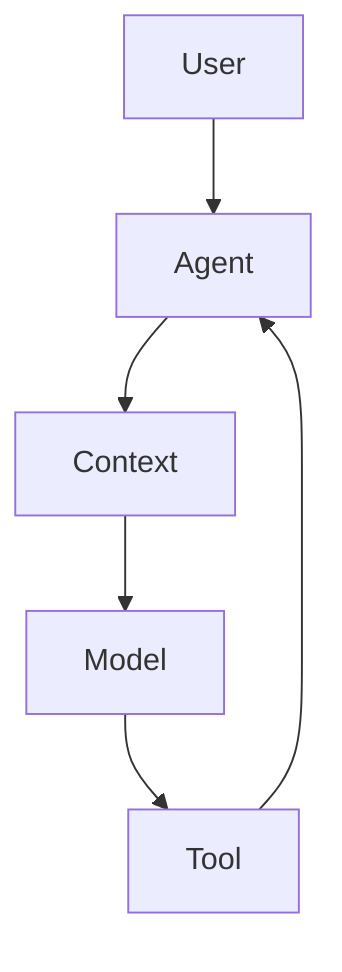
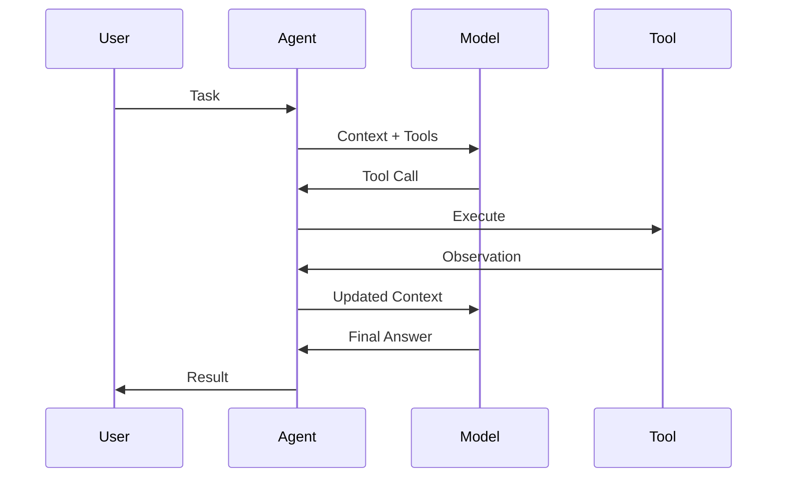
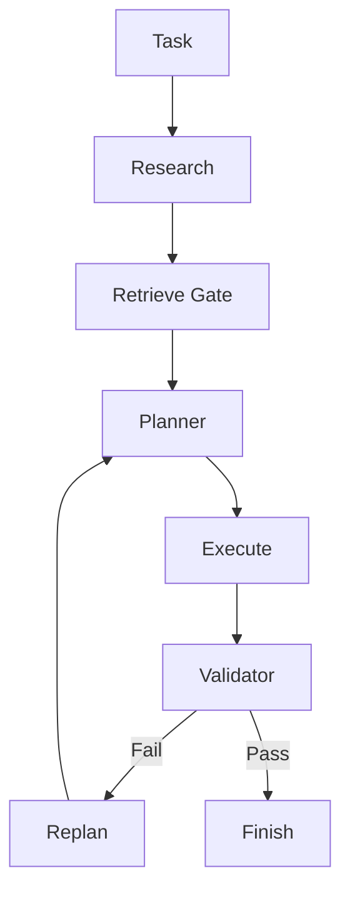

# Agent 技术栈源码阅读与实战路线

> 目标：从第一性原理出发，通过阅读与改造开源项目，逐步建立一套不依赖单一框架、可用于生产级 Agent 系统设计与实现的完整技术栈。  
> 当前范围：暂不深入模型推理实现，将模型视为统一接口；完成 Agent 上层系统能力后，再进入 SGLang、推理服务、调度、KV Cache、GPU 与 Kernel 层。

---

# 1. 总目标

这条路线的目标不是“会使用几个 Agent 框架”，而是最终能够独立回答并实现以下问题：

1. Agent 的执行循环如何工作？
2. Tool 如何注册、发现、调用、鉴权和治理？
3. Context 如何构建、压缩、裁剪和注入？
4. Agent 的 State 如何表示？
5. Agent 运行中断后如何恢复？
6. 长期 Memory 如何写入、检索、重排、遗忘和评估？
7. Planner、Research、Retrieve、Execute、Validate 如何形成 Harness？
8. 多 Agent 如何协作而不造成状态失控？
9. Agent 如何通过 Gateway、Session、Channel 变成长期在线系统？
10. Agent 如何通过 API、Queue、DB、Sandbox、Tracing、Eval 进入生产？
11. 如果不用 LangGraph / OpenClaw / OpenCode / EverOS，能否自己实现核心机制？
12. 最后如何继续向下进入 SGLang 与推理基础设施？

最终你需要形成的能力不是：

```text
会使用 LangGraph
会调用 MCP
会配置 OpenClaw
```

而是：

```text
能够自己设计并实现一个生产级 Agent Runtime + Harness + Memory + Tool System
```

---

# 2. 第一性原理：一个生产 Agent 到底由什么组成

从最基本的定义开始：

```text
Agent
=
Model
+
State
+
Context
+
Action
+
Observation
+
Control Loop
```

如果进一步进入生产环境：

```text
Production Agent
=
Agent
+
Tool System
+
Memory
+
Planner
+
Validator
+
Checkpoint
+
Permission
+
Sandbox
+
Observability
+
Deployment
```

因此整个 Agent 技术栈可以抽象成：



当前学习边界：

```text
┌───────────────────────────────┐
│ Agent Product                 │
│ Agent Harness                 │
│ Agent Runtime                 │
│ Memory                        │
│ Tool Protocol                 │
│ Infrastructure                │
├───────────────────────────────┤
│ Model API                     │  ← 当前只把它当接口
├───────────────────────────────┤
│ SGLang                        │  ← 下一阶段
│ GPU / CUDA / Kernel           │
└───────────────────────────────┘
```

---

# 3. 总体学习路线

主线：

```text
Stage 0  准备：建立统一阅读模板
    ↓
Stage 1  smolagents
    ↓
Stage 2  MCP
    ↓
Stage 3  OpenCode
    ↓
Stage 4  LangGraph
    ↓
Stage 5  EverOS
    ↓
Stage 6  OpenClaw
    ↓
Stage 7  Agno
    ↓
Stage 8  自研 Agent Harness
    ↓
Stage 9  SGLang
```

每个项目承担不同任务：

| 阶段 | 项目 | 核心学习目标 |
|---|---|---|
| 0 | 阅读方法 | 建立统一的源码分析方法 |
| 1 | smolagents | Agent Loop / Tool Call / Observation |
| 2 | MCP | Tool Protocol / Transport / Capability |
| 3 | OpenCode | Coding Harness / Context / Planner / Permission |
| 4 | LangGraph | Stateful Runtime / Checkpoint / Resume |
| 5 | EverOS | Long-term Memory / Retrieve / Consolidation |
| 6 | OpenClaw | Gateway / Session / Channel / Productization |
| 7 | Agno | Agent Platform / API / Runtime / Deployment |
| 8 | 自研 | 整合成自己的 Harness |
| 9 | SGLang | 推理服务与模型层 |

---

# 4. Stage 0：建立统一源码阅读方法

## 4.1 禁止“从第一行看到最后一行”

大型 Agent 项目禁止线性阅读。

统一采用：

```text
WHY
↓
WHAT
↓
RUN
↓
FLOW
↓
STATE
↓
CONTROL
↓
CONTEXT
↓
TOOL
↓
FAILURE
↓
MODIFY
```

详细解释如下。

### ① WHY

回答：

```text
这个项目到底解决什么问题？
如果没有它，开发者必须自己做什么？
```

### ② WHAT

回答：

```text
项目对外提供什么能力？
核心抽象是什么？
```

例如：

```text
Agent
Tool
Session
State
Graph
Checkpoint
Memory
Gateway
```

### ③ RUN

必须跑起来一个最小 Demo。

禁止只看 README。

### ④ FLOW

追踪一条真实请求：

```text
User
→ API / CLI
→ Agent
→ Context
→ Model
→ Tool
→ Result
→ Agent
→ Response
```

### ⑤ STATE

回答：

```text
状态在哪里？
状态是什么结构？
谁可以修改？
什么时候持久化？
```

### ⑥ CONTROL

回答：

```text
是谁决定下一步做什么？
```

可能是：

```text
while loop
state machine
graph
planner
router
model
rule engine
```

### ⑦ CONTEXT

回答：

```text
模型最终看到的输入到底有哪些？
```

### ⑧ TOOL

回答：

```text
Tool 如何：
注册
发现
调用
执行
返回结果
失败
鉴权
```

### ⑨ FAILURE

回答：

```text
Tool 失败怎么办？
模型失败怎么办？
程序宕机怎么办？
执行到一半怎么办？
```

### ⑩ MODIFY

至少修改一个核心机制。

没有修改源码，不算真正读懂。

---

# 5. 每个开源项目统一输出四份成果

所有项目必须输出以下四项。

## 5.1 Architecture Diagram

示例：



## 5.2 Sequence Diagram



## 5.3 Source Call Chain

必须写出真实调用链：

```text
run()
  → step()
  → build_context()
  → call_model()
  → parse_tool_call()
  → execute_tool()
  → append_observation()
```

## 5.4 Modification

例如：

```text
smolagents
→ 自己增加 StopCondition

MCP
→ 自己实现 MCP Tool Server

OpenCode
→ 自定义 Agent / Tool / Hook

LangGraph
→ 自己实现 Checkpoint

EverOS
→ 修改 Retrieve Gate

OpenClaw
→ 新增 Skill / Plugin

Agno
→ 自己部署 Agent Runtime
```

---

# 6. Stage 1：smolagents

## 6.1 学习目标

第一阶段只解决一个问题：

> Agent 为什么能够持续执行任务？

核心：

```text
Agent Loop
Tool
Observation
Memory
Stop Condition
```

暂时忽略：

```text
复杂 Planner
Memory System
Graph Runtime
Distributed System
```

---

# 7. Agent Loop 第一性原理

最小 Agent：

```python
while not finished:

    context = build_context()

    result = model(context, tools)

    if result.tool_call:
        observation = execute_tool(result.tool_call)
        context.append(observation)

    else:
        return result
```

整个 Agent 系统的最原始形态就是：

```text
Think
↓
Act
↓
Observe
↓
Think
```

---

# 8. smolagents 源码阅读重点

优先关注：

```text
MultiStepAgent
ToolCallingAgent
CodeAgent
AgentMemory
Tool
```

重点追踪：

```text
run
 ↓
step
 ↓
model
 ↓
tool call
 ↓
execute
 ↓
observation
 ↓
memory
 ↓
next step
```

不要深入：

```text
Transformer
Tokenizer
Model Kernel
GPU
```

---

# 9. Stage 1 实验任务

## Task 1：Mini Agent

自己实现：

```text
mini_agent/
├── agent.py
├── model.py
├── tools.py
├── memory.py
├── context.py
└── main.py
```

至少支持：

```text
Tool Registry
Tool Call
Observation
Conversation History
Max Steps
Stop Condition
Exception Handling
```

目标代码量：

```text
500 ~ 1000 LOC
```

---

# 10. Stage 1 验收标准

必须能回答：

```text
为什么 Agent Loop 可能无限循环？
Stop Condition 应该放在哪里？
Tool Result 为什么必须重新进入 Context？
Code Agent 与 Tool Calling Agent 本质区别是什么？
Agent Memory 与长期 Memory 有什么区别？
```

完成后进入 Stage 2。

---

# 11. Stage 2：MCP

## 11.1 核心目标

理解：

> Agent 如何标准化连接外部能力？

第一性原理：

```text
Agent 不应该知道工具具体实现。

Agent 只应该知道：
工具名称
输入 Schema
能力描述
调用协议
返回结果
```

因此：

```text
Agent
  ↓
Tool Protocol
  ↓
Tool Provider
```

---

# 12. Tool 第一性原理

生产级 Tool 应该理解成：

```text
Tool
=
Capability
+
Schema
+
Permission
+
Transport
+
Lifecycle
+
Error Semantics
```

而不是：

```python
def foo():
    pass
```

---

# 13. MCP 重点学习内容

重点：

```text
MCP Client
MCP Server
Transport
Tool
Resource
Prompt
Capability Negotiation
Session
Schema
Error
```

重点理解：

```text
Host
 ↓
Client
 ↓
Transport
 ↓
Server
 ↓
Tool Registry
 ↓
Tool
```

---

# 14. Stage 2 实验

实现三个 MCP Server：

```text
filesystem
git
search
```

结构：

```text
Mini Agent
    ↓
MCP Client
    ↓
┌──────────────┐
│ Filesystem   │
│ Git          │
│ Search       │
└──────────────┘
```

至少完成：

```text
Tool Discovery
Tool Schema
Tool Invocation
Error Handling
Timeout
```

---

# 15. Stage 2 验收

必须能回答：

```text
MCP 和普通 REST API 有什么区别？
为什么 Agent Tool 需要 Schema？
Transport 和 Capability 为什么必须分离？
MCP Client 和 Agent Host 有什么区别？
Tool 权限应该在 Agent 还是 Server 控制？
```

---

# 16. Stage 3：OpenCode

这是整条路线最重要的阶段之一。

目标：

> 学习现代 Coding Agent Harness。

---

# 17. 什么是 Harness

第一性原理：

```text
Model ≠ Agent
```

真正的 Coding Agent：

```text
Coding Agent
=
Model
+
Context Engineering
+
Tool System
+
Planner
+
Agent Loop
+
Permission
+
Sandbox
+
Validation
+
Session
```

---

# 18. OpenCode 阅读重点

不要从 TUI 开始。

先追请求：

```text
User
 ↓
Session
 ↓
Agent
 ↓
Context
 ↓
Model
 ↓
Tool Call
 ↓
Permission
 ↓
Tool
 ↓
Result
 ↓
Context Update
 ↓
Model
```

重点模块：

```text
Agent
Session
Prompt
Context
Tool
Permission
MCP
LSP
Plan
Build
Explore
Compaction
Summary
```

---

# 19. 重点研究：Context Engineering

把 Context 拆成：

```text
Context
├── System Instructions
├── User Task
├── Repository Context
├── Tool Definitions
├── Tool Results
├── Conversation History
├── Plan
├── Memory
├── Runtime State
└── Metadata
```

必须研究：

```text
什么应该进入 Context？
什么时候进入？
Context 超长怎么办？
谁决定删除？
什么时候 Summary？
什么时候 Compaction？
Tool Result 保存多久？
Repository Context 如何挑选？
```

---

# 20. Stage 3 实验

在自己的 mini-agent 中增加：

```text
ContextManager
Planner
PermissionManager
Validator
```

演进：

```text
Mini Agent v1

AgentLoop
Tool
Memory
```

升级：

```text
Mini Agent v2

AgentLoop
├── ContextManager
├── Planner
├── ToolRouter
├── Permission
└── Validator
```

---

# 21. Stage 3 实战任务

实现一个：

```text
Mini Coding Agent
```

要求：

```text
读取 Git Repository
搜索文件
读取代码
修改代码
执行测试
失败后重新修改
最终返回 Diff
```

流程：

```text
Task
 ↓
Inspect Repo
 ↓
Plan
 ↓
Read
 ↓
Edit
 ↓
Test
 ↓
Fail?
 ├── Yes → Replan
 └── No → Finish
```

---

# 22. Stage 3 验收标准

能回答：

```text
为什么相同模型在不同 Coding Agent 中能力差距巨大？
Context Manager 为什么比 Prompt 更重要？
Planner 应不应该完全交给模型？
什么时候应该进行 Compaction？
Tool Result 为什么不能无限进入 Context？
Permission 为什么必须成为 Harness 一部分？
```

---

# 23. Stage 4：LangGraph

## 23.1 目标

从：

```text
Agent Loop
```

升级为：

```text
Agent Runtime
```

解决：

```text
状态
恢复
重试
中断
持久化
Human-in-the-loop
```

---

# 24. Runtime 第一性原理

简单 Agent：

```text
while true
```

生产 Agent：

```text
State Machine
+
Persistent State
+
Durable Execution
```

模型：

```text
State
 ↓
Node
 ↓
Transition
 ↓
State
```

---

# 25. LangGraph 重点源码概念

重点：

```text
State
Node
Edge
Checkpoint
Interrupt
Resume
Retry
Store
Thread
Execution
```

不要只学习：

```python
graph.add_node()
graph.add_edge()
```

真正的问题是：

```text
执行状态如何保存？
Node 如何恢复？
失败后从哪里继续？
Side Effect 如何避免重复执行？
Interrupt 如何等待人类？
Graph 如何进行条件跳转？
```

---

# 26. Stage 4 实验

把之前的 Agent 重构为：

```text
Understand
 ↓
Research
 ↓
Retrieve
 ↓
Plan
 ↓
Execute
 ↓
Validate
 ├── Fail → Replan
 └── Pass → Finish
```

要求加入：

```text
Checkpoint
Retry
Resume
Human Approval
Interrupt
```

---

# 27. Stage 4 重点实验：Crash Recovery

实验：

```text
Task
 ↓
Plan
 ↓
Execute Step 1
 ↓
Checkpoint
 ↓
Execute Step 2
 ↓
模拟进程 Crash
 ↓
Restart
 ↓
Resume
 ↓
Execute Step 3
```

必须验证：

```text
Step 1 不重复
Step 2 状态一致
最终结果正确
```

---

# 28. Stage 4 验收标准

能够独立解释：

```text
Agent State 和 Conversation History 区别
Checkpoint 和 Memory 区别
Retry 和 Resume 区别
Durable Execution 为什么复杂
Side Effect 为什么危险
如何实现 idempotency
```

---

# 29. Stage 5：EverOS

目标：

> 理解 Long-term Memory System。

注意：

```text
Memory ≠ Vector Database
```

真正的 Memory：

```text
Memory
=
Write
+
Represent
+
Index
+
Retrieve
+
Rank
+
Consolidate
+
Update
+
Forget
+
Evaluate
```

---

# 30. Memory Pipeline

```text
Experience
 ↓
Memory Candidate
 ↓
Write Gate
 ↓
Representation
 ↓
Store
 ↓
Index
```

读取：

```text
Task
 ↓
Retrieve Gate
 ↓
Candidate Search
 ↓
Fusion
 ↓
Rerank
 ↓
Filter
 ↓
Context Injection
```

---

# 31. EverOS 阅读重点

重点研究：

```text
Memory Type
Memory Lifecycle
Retrieval
Consolidation
Reflection
Evaluation
Evolution
```

同时和你自己的 Agent Memory Engine 对照：

```text
Episode
Semantic
Foresight
Decision
Retrieve Gate
Fusion
Reranker
```

---

# 32. Stage 5 核心实验

实现：

```text
MemoryEngine
├── WriteGate
├── Retriever
├── Fusion
├── Reranker
├── Forget
└── Evaluation
```

要求支持：

```text
SQLite / PostgreSQL
+
LanceDB
```

---

# 33. Stage 5 Retrieve Gate 实验

Retrieve Gate 输入：

```text
Task
Context
Agent State
History
```

输出：

```text
NO_RETRIEVE
LOCAL_MEMORY
SEMANTIC_MEMORY
EPISODIC_MEMORY
MULTI_ROUTE
```

不要只写死规则。

至少实现：

```text
Rule
+
Score
+
Model Router
```

三种模式。

做 A/B Test：

```text
Recall
Precision
Latency
Token Cost
Task Success Rate
```

---

# 34. Stage 5 验收标准

能回答：

```text
什么信息值得写入长期 Memory？
什么时候不应该检索？
Memory 为什么需要 Forget？
为什么必须做 Rerank？
Retrieve Gate 如何减少噪声？
Memory 和 Context 的关系是什么？
```

---

# 35. Stage 6：OpenClaw

目标：

> 学习一个 Agent 如何变成长期在线系统。

---

# 36. OpenClaw 阅读重点

重点：

```text
Gateway
Session
Channel
Agent
Skill
Tool
Plugin
Node
Identity
Permission
Lifecycle
```

不要优先研究 UI。

---

# 37. OpenClaw 第一性原理

一个长期在线 Agent：

```text
User
 ↓
Channel
 ↓
Gateway
 ↓
Session
 ↓
Agent Harness
 ↓
Tool / Skill
 ↓
External World
```

核心不是 Agent Loop。

而是：

```text
Control Plane
+
Session
+
Transport
+
Identity
+
Lifecycle
```

---

# 38. Stage 6 实验

自己实现：

```text
Agent Gateway
```

支持：

```text
HTTP
WebSocket / SSE
Session
Agent Routing
Tool Routing
Authentication
```

架构：

```text
Client
 ↓
Gateway
 ↓
Session Manager
 ↓
Agent Runtime
 ↓
Tools
```

---

# 39. Stage 6 第二实验

增加：

```text
Channel Adapter
```

例如：

```text
CLI
Web
Telegram-like Adapter
Enterprise WeChat Adapter
```

最终接口统一为：

```text
ChannelMessage
```

---

# 40. Stage 6 验收

能够解释：

```text
Gateway 和普通 REST API 有什么区别？
Session 与 Conversation 有什么区别？
为什么长期 Agent 必须有 Identity？
Channel 为什么需要 Adapter？
Skill 与 Tool 有什么区别？
```

---

# 41. Stage 7：Agno

目标：

> 学习 Agent Platform。

重点不再是：

```text
如何调用 Agent
```

而是：

```text
如何部署 Agent
如何管理 Agent
如何监控 Agent
```

---

# 42. Agent Platform 第一性原理

生产平台：

```text
Agent Platform
=
Runtime
+
API
+
Auth
+
Persistence
+
Queue
+
Observability
+
Control Plane
+
Deployment
```

---

# 43. Agno 阅读重点

重点：

```text
Agent
Team
Workflow
Runtime
Memory
Knowledge
API
Control Plane
Telemetry
Deployment
```

---

# 44. Stage 7 实验

将自己的 Agent 系统部署成：

```text
FastAPI
+
PostgreSQL
+
Redis
+
Worker
+
Docker
+
OpenTelemetry
```

要求：

```text
POST /agents/run
GET  /runs/{id}
POST /runs/{id}/resume
GET  /runs/{id}/events
```

---

# 45. Stage 7 验收

能够回答：

```text
为什么 Agent 不能直接跑在 HTTP Request 生命周期？
什么时候需要 Worker？
什么时候需要 Queue？
Session State 放哪里？
Trace 如何串联 Tool Call？
Agent Eval 如何进入生产系统？
```

---

# 46. Stage 8：构建自己的 Agent Harness

这是整条路线真正的终点。

项目建议：

```text
agent-runtime/
├── api/
├── agent/
├── context/
├── planner/
├── research/
├── retrieve/
├── memory/
├── tools/
├── mcp/
├── runtime/
├── checkpoint/
├── validator/
├── sandbox/
├── permission/
├── telemetry/
└── storage/
```

---

# 47. 推荐核心接口

## AgentState

```python
class AgentState:
    task
    plan
    messages
    context
    memory
    current_step
    tool_results
    status
```

## AgentNode

```python
class AgentNode:
    async def execute(self, state):
        ...
```

## Tool

```python
class Tool:
    name
    description
    input_schema

    async def execute(self, args):
        ...
```

## ContextManager

```python
class ContextManager:
    def build(self, state):
        ...

    def compact(self, context):
        ...
```

## Retriever

```python
class Retriever:
    async def retrieve(self, query, state):
        ...
```

## Validator

```python
class Validator:
    async def validate(self, state):
        ...
```

---

# 48. 推荐 Harness 流程



---

# 49. Context Manager 推荐结构

```text
ContextManager
├── SystemContext
├── TaskContext
├── RepositoryContext
├── ToolContext
├── MemoryContext
├── PlanContext
├── RuntimeContext
├── HistoryContext
├── Compressor
└── TokenBudget
```

核心目标：

```text
Context Quality
而不是
Context Quantity
```

---

# 50. Planner 推荐架构

不要：

```text
Task
 ↓
LLM
 ↓
Plan
```

推荐：

```text
Task
 ↓
Research
 ↓
Retrieve
 ↓
Constraint Extraction
 ↓
Planner
 ↓
Plan Validator
 ↓
Execution Plan
```

计划必须结构化：

```json
{
  "goal": "...",
  "constraints": [],
  "steps": [],
  "verification": []
}
```

---

# 51. Validator 推荐架构

```text
Validator
├── Rule Validator
├── Test Validator
├── Schema Validator
├── Model Judge
└── Human Approval
```

原则：

```text
优先 deterministic validation
最后才使用 LLM Judge
```

---

# 52. Permission Model

工具不要默认全部开放。

推荐：

```text
Permission
├── READ
├── WRITE
├── EXECUTE
├── NETWORK
├── SECRET
└── DESTRUCTIVE
```

Agent 请求：

```text
Tool Call
 ↓
Permission Check
 ↓
Allowed?
 ├── Yes → Execute
 └── No → Approval
```

---

# 53. Sandbox

Coding Agent 尤其必须有 Sandbox。

至少隔离：

```text
Filesystem
Process
Network
Environment Variable
Secrets
CPU
Memory
Execution Time
```

---

# 54. Observability

每一次 Agent Run 建议有统一 Trace：

```text
Trace
└── Agent Run
    ├── Planner
    ├── Retrieval
    ├── Model Call
    ├── Tool Call
    ├── Validator
    └── Memory Write
```

关键指标：

```text
Task Success
Latency
Token
Tool Error
Retry
Memory Hit
Retrieve Precision
Validation Pass
Human Intervention
```

---

# 55. Eval

生产 Agent 必须有 Eval。

建立：

```text
eval/
├── dataset/
├── runner/
├── metrics/
├── judge/
└── reports/
```

核心指标：

```text
Task Completion Rate
Test Pass Rate
Tool Success Rate
Hallucination Rate
Average Steps
Average Tokens
Latency
Cost
Human Rework
```

---

# 56. 推荐最终技术栈

## Language

```text
Python
├── Runtime
├── Memory
├── Eval
└── Backend

TypeScript
├── OpenCode
├── OpenClaw
└── Web / Gateway

Rust / C++
└── 后续 SGLang / Systems
```

---

# 57. Protocol

```text
MCP
HTTP
JSON-RPC
SSE
WebSocket
```

---

# 58. Storage

```text
PostgreSQL
├── Session
├── State
├── Metadata
└── Memory

Redis
├── Cache
├── Lock
└── Queue

LanceDB
└── Vector Retrieval
```

---

# 59. Infrastructure

```text
FastAPI
asyncio
Docker
Worker
Queue
OpenTelemetry
```

---

# 60. 建议仓库结构

最终可以维护一个自己的实验仓库：

```text
agent-stack-lab/

00-reading-notes/

01-mini-agent/
02-mcp/
03-coding-harness/
04-agent-runtime/
05-memory-engine/
06-agent-gateway/
07-agent-platform/
08-production-agent/

docs/
├── architecture/
├── sequence/
├── source-call-chain/
└── adr/

eval/
tests/
benchmarks/
```

---

# 61. 每阶段时间建议

不要死卡日期。

推荐按“掌握标准”推进。

参考：

```text
Stage 0   1~2 天
Stage 1   5~7 天
Stage 2   5~7 天
Stage 3   2~3 周
Stage 4   2 周
Stage 5   2~3 周
Stage 6   2~3 周
Stage 7   1~2 周
Stage 8   持续迭代
```

整个 Agent 上层体系：

```text
约 3~4 个月
```

重点不是速度。

重点是：

```text
每一个阶段都真正自己实现一次。
```

---

# 62. 推荐每周节奏

## Day 1

```text
WHY
WHAT
RUN
```

## Day 2

```text
FLOW
Architecture
```

## Day 3

```text
STATE
CONTROL
```

## Day 4

```text
CONTEXT
TOOL
```

## Day 5

```text
FAILURE
```

## Day 6

```text
MODIFY
```

## Day 7

```text
总结
重构
输出文档
```

---

# 63. 每阶段必须回答的十个问题

统一模板：

```text
1. 项目解决什么问题？
2. 核心抽象是什么？
3. 一条请求如何流转？
4. State 在哪里？
5. Control Flow 谁决定？
6. Context 如何生成？
7. Tool 如何执行？
8. Failure 如何处理？
9. Persistence 如何实现？
10. 我能否自己实现核心机制？
```

---

# 64. 必须避免的学习误区

## 误区 1：把 Framework API 当技术能力

错误：

```text
会 LangGraph = 会 Agent Runtime
```

正确：

```text
理解 Stateful Execution
才等于理解 Runtime
```

---

## 误区 2：不停换项目

不要：

```text
LangGraph
CrewAI
AutoGen
Agno
Mastra
...
```

这样大量时间会消耗在：

```text
不同 API
相同概念
```

---

## 误区 3：一开始研究 Multi-Agent

Multi-Agent 应该放后面。

单 Agent 都没有：

```text
State
Context
Memory
Validation
```

就研究 Multi-Agent，复杂度会指数增加。

---

## 误区 4：Memory = Vector DB

这是最常见错误。

```text
Vector DB
```

只是：

```text
Memory Index
```

的一部分。

---

## 误区 5：Prompt Engineering 代替 Harness

真正影响 Agent 的不只是 Prompt。

而是：

```text
Tool
Context
State
Planning
Validation
Memory
Execution
```

---

# 65. SGLang 进入条件

不要按照日期进入。

当你能够独立解释：

```text
Agent Loop
Tool System
MCP
Context Manager
Planner
Validator
Agent Runtime
Checkpoint
Memory
Gateway
Session
Observability
Eval
```

并且已经实现：

```text
自己的生产级 Agent Prototype
```

再进入 SGLang。

---

# 66. 下一阶段：SGLang

进入 SGLang 后，学习路线变为：

```text
Model API
 ↓
Serving
 ↓
Scheduler
 ↓
Batching
 ↓
Prefill
 ↓
Decode
 ↓
KV Cache
 ↓
Paged Attention
 ↓
RadixAttention
 ↓
Tensor Parallel
 ↓
Pipeline Parallel
 ↓
CUDA
 ↓
Kernel
```

此时你会形成完整链路：

```text
User
 ↓
Agent Product
 ↓
Harness
 ↓
Runtime
 ↓
Model API
 ↓
SGLang
 ↓
GPU
```

---

# 67. 最终能力判断标准

如果未来拿掉所有框架，只给你：

```text
Python
PostgreSQL
Redis
Docker
LLM API
```

你依然可以自己设计：

```text
Agent Loop
Tool System
Context Manager
Planner
Retrieve Gate
Memory
Validator
Checkpoint
Gateway
Session
Eval
Observability
```

那么这套 Agent 技术栈才真正建立完成。

---

# 68. 建议的实际执行顺序

从现在开始：

```text
第一步
smolagents
→ 只研究 Agent Loop

第二步
自己写 Mini Agent

第三步
MCP
→ 把 Tool 抽成协议

第四步
OpenCode
→ 研究 Harness

第五步
升级 Mini Agent → Coding Agent

第六步
LangGraph
→ 重构 Runtime

第七步
EverOS
→ 接入 Memory Engine

第八步
OpenClaw
→ 做 Gateway / Session

第九步
Agno
→ 学生产 Platform

第十步
独立完成 Agent Harness v1

第十一步
进入 SGLang
```

---

# 69. 你当前最应该做的事情

不要马上继续阅读更多 Agent 项目。

从：

```text
smolagents
```

开始。

目标只有一个：

> 从源码层面彻底弄清楚 Agent Loop。

完成后立刻自己实现：

```text
Mini Agent v1
```

然后再进入 MCP。

整个过程中始终遵守：

```text
READ
 ↓
TRACE
 ↓
DRAW
 ↓
IMPLEMENT
 ↓
BREAK
 ↓
FIX
 ↓
UNDERSTAND
```

这条路线的最终目的不是成为某个框架的熟练用户，而是建立属于自己的：

```text
Agent Engineering Mental Model
+
Agent Runtime
+
Agent Harness
+
Agent Memory
+
Agent Platform
```

当这些完成以后，再向下进入 SGLang，整个技术栈就会从：

```text
Application
```

一路贯穿到：

```text
Inference Runtime
```

最终形成真正完整的 Agent 系统能力。
